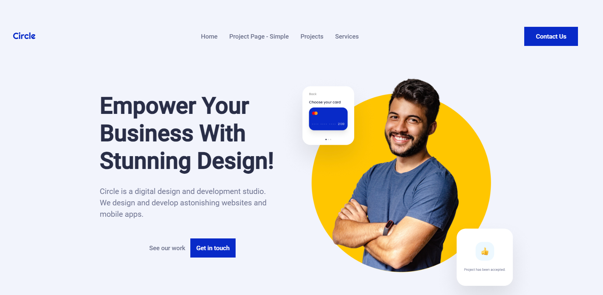
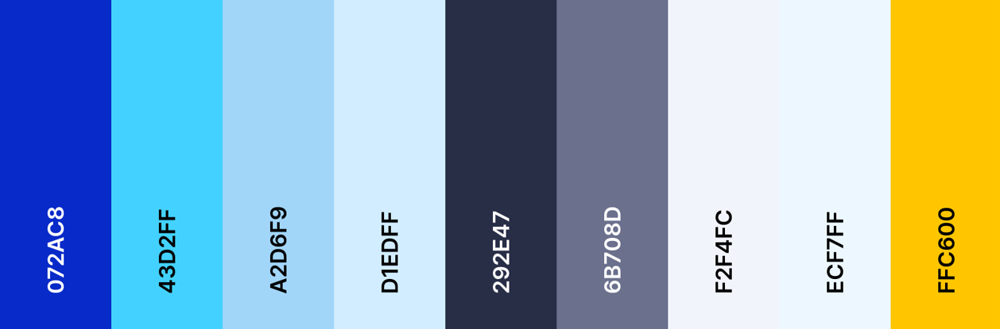
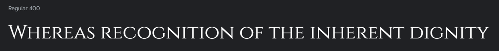
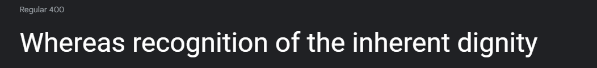
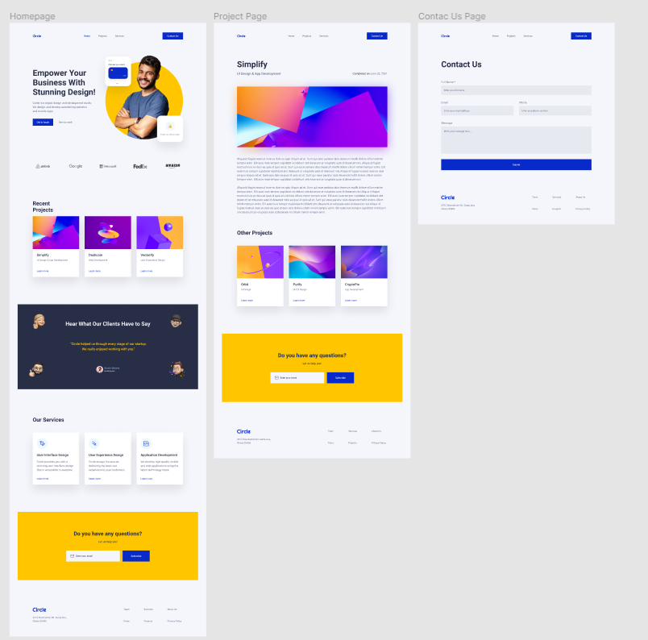

# Circle Agency Project

Developer: [Kim Bergström](https://github.com/KimBergstroem)  
[Live webpage](https://midterm-agency-client-project.netlify.app/) 
[Project Repository](https://github.com/KimBergstroem/midterm-agency-client-project) 

The Circle Agency Project is an exciting endeavor aimed at developing a comprehensive website for Circle Agency, a dynamic and forward-thinking company. This web platform will serve as a digital hub, showcasing Circle Agency's services, projects, and values to potential clients and stakeholders. With a focus on modern design, user experience, and functionality, the website will aim to captivate visitors and convey the essence of Circle Agency's brand identity.

## **Table of Content**

- 📄[**User Experience**](#user-experience-ux)

  - [User Stories](#user-stories)

- 📄 [**Design**](#design)

  - [Colour Scheme](#colour-scheme)
  - [Typography](#typography)
  - [Imagery](#imagery)
  - [Wireframes](#wireframes)

- 📄 [**Features**](#features)

  - [General Features on Each Page](#general-features-on-each-page)
  - [Future Implementations](#future-implementations)
  - [Accessibility](#accessibility)

- 📄 [**Technologies Used**](#technologies-used)

  - [Languages Used](#languages-used)
  - [Frameworks, Libraries & Programs Used](#frameworks-libraries--programs-used)

- 📄 [**Deployment & Local Development**](#deployment--local-development)

  - [Deployment](#deployment)
  - [Local Development](#local-development)
    - [How to Fork](#how-to-fork)
    - [How to Clone](#how-to-clone)

- 📄 [**Testing**](#testing)

  - [Solved Bugs](#Bugs)
  - [Known Bugs](#Bugs)

- 📄 [**Credits**](#credits)
  - [Code Used](#code-used)
  - [Content](#content)
  - [Media](#media)
  - [Acknowledgments](#acknowledgments)
  - [License](#license)

  

# **User Experience (UX)**

#### Key information for the site

- Gain insight into Circle Agency's services, portfolio, and contact information.
- Understand the company's mission, values, and commitment to quality design.
- Navigate easily to find details about projects, team members, and testimonials.
- Explore career opportunities and learn about the company culture.
- Contact the agency for inquiries, collaborations, or to schedule a consultation.

### User Stories

#### Client Goals

- Ensure the website is accessible and user-friendly across various devices and screen sizes.
- Simplify the process for potential clients to inquire about services or request quotes.
- Continuously update the website to showcase the latest projects and achievements.
- Implement interactive features to engage visitors and showcase the agency's creativity.
- Establish Circle Agency as a leading provider of web design solutions.
- Create an immersive and visually appealing experience for visitors of all backgrounds.

#### First Time Visitor Goals

- Feel welcomed and intrigued by the visually appealing design and layout.
- Navigate seamlessly to discover the agency's services, projects, and team members.
- Leave with a positive impression and interest in learning more about the agency's offerings.
- Easily find contact information and initiate communication with the agency.

#### Returning Visitor Goals

- Explore recent projects and updates since their last visit.
- Engage with interactive elements and features added to the website.
- Connect with familiar team members or discover new additions to the agency.
- Consider the agency for upcoming projects or collaborations.

#### Frequent Visitor Goals

- Stay informed about industry trends and insights shared by the agency.
- Participate in discussions or forums hosted by the agency to share expertise.
- Recommend the agency to peers and colleagues based on positive experiences.
- Utilize any loyalty programs or special offers provided by the agency for frequent clients.

(<a href="#readme-top">back to top</a>)

  

# **Design**

Design and wireframes are provided by the agency company.

### **Colour Scheme**

- Primary Color: #072ac8
- Lighter Shade of Primary Color: #a2d6f9
- Lightest Shade of Primary Color: #d1edff
- Secondary Light Color: #fce300
- Secondary Dark Color: #ffc600
- Light Neutral Color: #f4f6fc
- Medium Neutral Color: #6b708d
- Dark Neutral Color: #292e47
- Wrong/Error Color: #b33a3a
- Right/Success Color: #28a428
- White: #fff
- Black: #000
- Background Color: #000
- Line Color: #ff0055

&nbsp;

### **Typography**

Google Fonts was used for the following fonts:

- **Cinzel** was selected for headings and larger text elements across the site. It boasts elegant serif letterforms, lending a touch of sophistication to the design.

- **Roboto** serves as the primary typeface for body text, including paragraphs containing questions and answers. Developed by Christian Robertson, Roboto is a versatile sans-serif font known for its clean, modern appearance and excellent legibility.

- Heading H1 60 Bold
- Heading H2 50 Bold
- Heading H3 40 Bold
- Heading H4 24 Bold
- Body Intro Text 24 Medium
- Body Intro Text 20 Regular
- Headline Text 17 Regular
- Headline Text 17 Medium
- Caption 1 Text 15 Regular
- Caption 2 Text 13 Regular
  &nbsp;

### **Imagery**

All the images displayed on this site were provided by the agency company. All rights is referenced to the company itself.

&nbsp;

### **Wireframes**

I developed the Circle Agency Project in tandem with the agency's [Figma ](https://www.figma.com/) design that was provided. The design process involved collaborating closely with the agency's team to translate their vision into a tangible digital experience. By aligning with the **Figma design** provided by the agency, I ensured consistency and fidelity throughout the development process. This approach facilitated seamless integration of design elements and functionalities, resulting in a cohesive and polished final product.

The figma wireframes for the Circle Agency Project can be viewed below:

(<a href="#readme-top">back to top</a>)

  

# **Features**

### **Future-implementations**

&nbsp;

### **Accessibility**

I have been mindful during coding to ensure that the website is as accessible friendly as possible. I have achieved this by:

- Using semantic HTML elements as, header(), section(), nav().
- Declare the Language in the beginning of every html page.
- Using descriptive ALT attributes on images and links on the site.
- Using a hover state on all buttons on the site to make it clear to the user if they are hovering over a button or not.
- Providing information for screen readers where there are icons used and no text.
- Ensuring that there is a sufficient colour contrast throughout the site.
- Ensuring menus are accessible by marking the current page as current for screen readers.

(<a href="#readme-top">back to top</a>)

  

# **Technologies Used**

### **Languages Used**

- Hyper Text Markup Language (<b>HTML</b>)
- Cascading Style Sheets (<b>CSS</b>)
- Javascript (<b>JS</b>)

### **Frameworks, Libraries & Programs Used**

- **Git**: A distributed version control system used for tracking changes in the project's source code.
- **GitHub**: A web-based hosting service for version control repositories, used for storing and managing the project's source code.
- **Visual Studio**: Local development environment (IDE) used for developing and testing.
- **Netlify**: A cloud platform that enables deployment and hosting of web applications. Netlify was used for deploying the Circle Agency project to a live server.
- **Figma**: An online collaborative design tool that offers a wide range of design and prototyping capabilities. Figma was used for designing the Circle Agency project UI.
- **Google Fonts**: A collection of free and open-source fonts used for typography on Circle Agency's website.
- **Font Awesome**: A library of icons used for adding scalable vector icons to Circle Agency's website.
- **IronHacks Free API**: Provided access to project data such as images, titles, descriptions, and content dates, enhancing [feature/functionality] on the Circle Agency website.

(<a href="#readme-top">back to top</a>)

  

# **Deployment & Local Development**

### **Deploying on Netlify**

Netlify.com was used to deploy the live website. The instructions to achieve this are below:

1. **Log in (or sign up) to Netlify.com**: Go to [Netlify](https://www.netlify.com/) and log in to your account. If you don't have an account, you'll need to sign up for one.

2. **Connect your Git repository**: Once you're logged in, navigate to the "Sites" tab and click on the "New site from Git" button.

3. **Choose your Git provider and repository**: Select your Git provider (e.g., GitHub, GitLab, Bitbucket) and choose the repository for your project.

4. **Configure your build settings**: Netlify will automatically detect your build settings, but you can customize them if needed. Make sure the build command and publish directory are correctly configured for your project.

5. **Deploy your site**: Once you've configured your build settings, click on the "Deploy site" button. Netlify will start building and deploying your site.

6. **Customize your domain (optional)**: By default, Netlify will assign a random subdomain to your site (e.g., `https://random-subdomain.netlify.app`). If you have a custom domain, you can configure it in the site settings.

7. **Configure continuous deployment (optional)**: Netlify can automatically deploy updates to your site whenever you push changes to your Git repository. You can configure this in the "Build & deploy" settings.

### **Local Development**

#### How to Fork

To fork the repository:

1. Log in (or sign up) to Github.
2. Go to the repository for this project, https://github.com/KimBergstroem/midterm-agency-client-project.
3. Click the Fork button in the top right corner.

#### How to Clone

To clone the repository:

1. Log in (or sign up) to GitHub.
2. Go to the repository for this project, https://github.com/KimBergstroem/midterm-agency-client-project.
3. Click on the code button, select whether you would like to clone with HTTPS, SSH or GitHub CLI and copy the link shown.
4. Open the terminal in your code editor and change the current working directory to the location you want to use for the cloned directory.
5. Type 'git clone' into the terminal and then paste the link you copied in step 3. Press enter.

(<a href="#readme-top">back to top</a>)

  

# **Testing**

All testing was carried out in [Testing.md](TESTING.md).

&nbsp;

### **Solved Bugs**

| Type          | Bug                                                                                                                                                        | Solution                                                                                                 |
| ------------- | ---------------------------------------------------------------------------------------------------------------------------------------------------------- | -------------------------------------------------------------------------------------------------------- |
| navigation.js | [Dropdown menu remains visible on larger screens after resizing from mobile view](https://github.com/KimBergstroem/midterm-agency-client-project/issues/2) | Add js window.addEventListener function to hide dropdown menu when screen size exceeds mobile breakpoint |

&nbsp;

### **Known Bugs**

| Type      | Bug     | Solution |
| --------- | ------- | -------- |
| Script.js | Example | Example  |

&nbsp;

(<a href="#readme-top">back to top</a>)

  

# **Credits**

### **Code Used**

I'm grateful to [Iron Hack](https://www.ironhack.com/es-en) for equipping me with the education and resources necessary to improve my HTML/CSS and JavaScript skills. Their lessons have been essential in my understanding of the basic principles of web development.

### **Content**

- The content for the web application was curated by IronHack Bootcamp as part of an assignment.
- Text / Paragraphs provided by the bootcamp as well as content sourced from a free API.
- The README was collaboratively written with [ChatGPT](https://chat.openai.com/).
- English spellchecker as Google Chrome extension [Grammarly](https://www.grammarly.com/)

### **Learning Resources**

#### W3 Schools:

- [Tips on darkmode function](https://www.w3schools.com/howto/tryit.asp?filename=tryhow_js_toggle_dark_mode)

#### MDN Web Docs:

- [Functions, arrow functions, structures, fetchAPI](https://developer.mozilla.org/en-US/docs/Web/API/Document)

#### Various tutorials and YouTube channels:

I would like to extend my appreciation to the authors of the tutorials and YouTube channels that have shared their knowledge and expertise, enabling me to learn and apply best practices in building my project.

- [Kevin Powell - CSS - Best practices](https://www.youtube.com/@KevinPowell)

### **Acknowledgments**

I'd like to give recognition to the individuals who supported me in finishing this project:

&nbsp;

### **License**

This project is licensed under the MIT License - see the [LICENSE](LICENSE) file for details.

(<a href="#readme-top">back to top</a>)

  

