# Testing

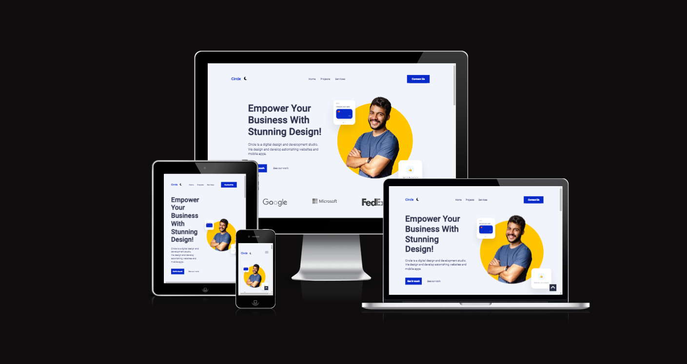

Developer: [Kim Bergström](https://github.com/KimBergstroem)  
[Live webpage](https://midterm-agency-client-project.netlify.app/) 
[Project Repository](https://github.com/KimBergstroem/midterm-agency-client-project) 

---

## Table of Content

- 📄 [**Automated Testing**](#automated-testing)
  - [W3C Validator](#w3c-validator)
  - [JavaScript Validator](#javaScript-validator)
  - [Lighthouse](#lighthouse)
  - [Wave Accessibility Test](#wave)
- 📄 [**Manual Testing**](#manual-testing)
  - [Testing User Stories](#testing-user-stories)
  - [Full Testing](#full-testing)

---

**Throughout the game development process, I relied on Google Developer Tools to experiment with different elements and phases of the game. Additionally, I leveraged the console section in Chrome Dev Tools to test JavaScript code and address any problems or glitches that occurred in the code.**

---

# **Automated Testing**

The W3C validator was used to validate the HTML on all pages of the website and the STYLESHEET in css file. JSHint was used to validate all my javascript files used for this project. Click on the below links to have the full validation. No error was found.

### **W3C Validator - HTML**

- [W3C validation for **index.html**]()
  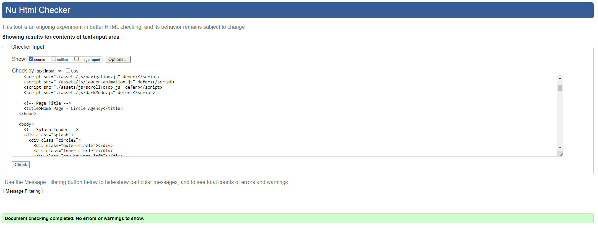

- [W3C validation for **project.html**]()
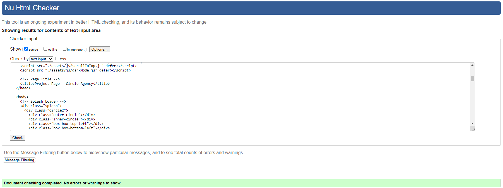

- [W3C validation for **contact.html**]()
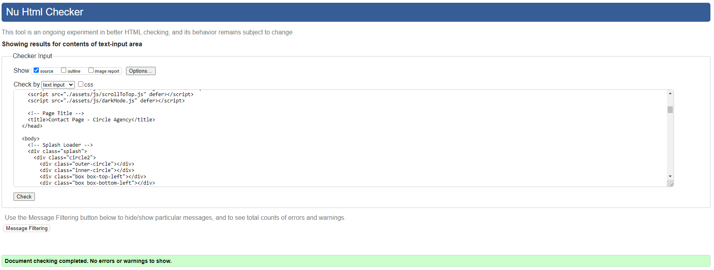

- [W3C validation for **404.html**]()
  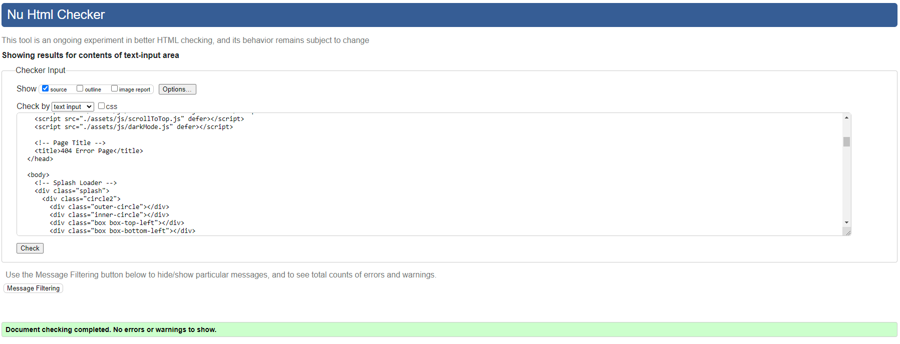

### **W3C Validator - CSS**

- [W3C validation for **style.css**]()
  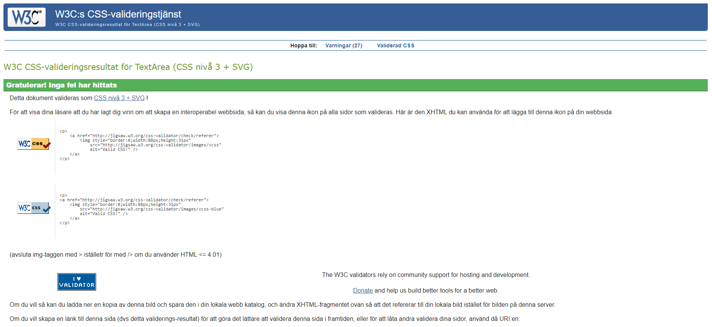

### **JavaScript Validator**

The code was passed through JSHint for testing, and no errors were found. Additionally, various metrics were returned, including the number of functions, the size of the largest function, and the complexity of the most complex function.

- [Js Hint validation for **contact.js**](https://jshint.com/)
  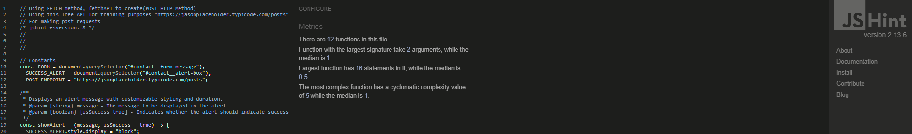

- [Js Hint validation for **contact.js**](https://jshint.com/)
  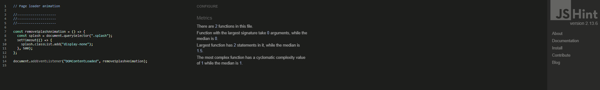

- [Js Hint validation for **contact.js**](https://jshint.com/)
  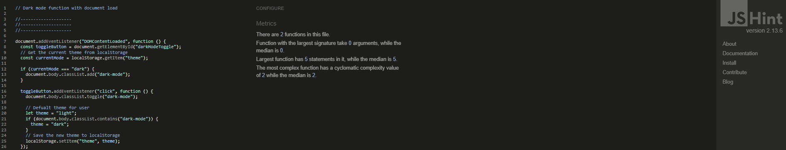

- [Js Hint validation for **contact.js**](https://jshint.com/)
  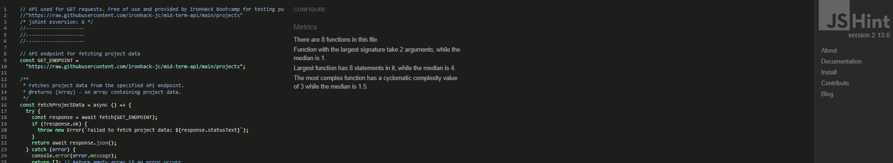

- [Js Hint validation for **contact.js**](https://jshint.com/)
  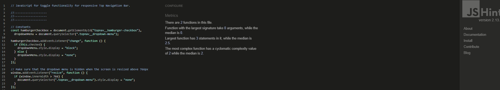

- [Js Hint validation for **contact.js**](https://jshint.com/)
  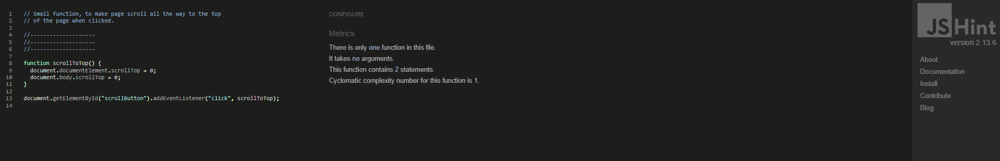

After validating these files, I decided to consolidate them into a single file named 'siteInteractions.js' to reduce HTTP requests and improve the web app's loading performance. This merged file now includes the functionality previously contained in 'animation.js', 'darkmode.js', 'navigation.js', and 'scrollToTop.js'.

### **Lighthouse**

Lighthouse is a tool from Google that helps you test and improve your website's performance, accessibility, SEO, and best practices. It provides insights and recommendations to enhance the user experience and ensure your site meets industry standards.

- [index.html lighthouse desktop](#https)
  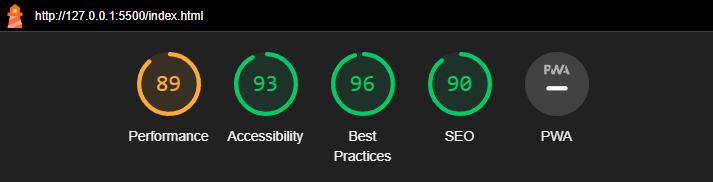

- [project.html lighthouse desktop](#https)
  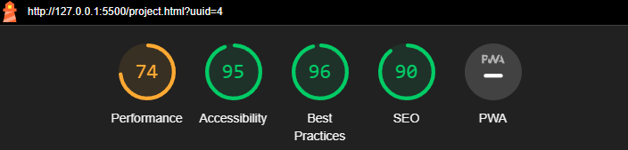

- [contact.html lighthouse desktop](#https)
  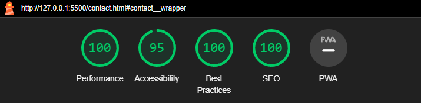

- [404.html lighthouse desktop](#https)
  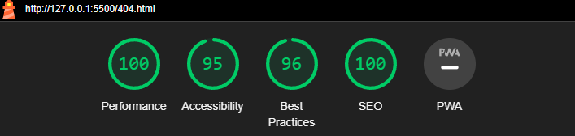

### **Wave**

To check the color contrast ratio between foreground and background elements, ensuring that the website is accessible to all users, including those with visual impairments. No errors or contrast error was found.

- [index.html Wave Contrast checker](#Https)

  

---

# **Manual Testing**

### **Testing User Stories**

**`First Time Visitors`**

| First Time User Goals                                       | How this was achieved                                        | Status                                                               |
| ------------------------------------------------------------ | ------------------------------------------------------------- | --------------------------------------------------------------------- |
| Feel welcomed and intrigued by the visually appealing design and layout. | Checked the homepage layout and design for visual appeal.     | &#x2714;                                                             |
| Navigate seamlessly to discover the agency's services, projects, and team members. | Tested navigation menu and links to ensure smooth navigation. | &#x2714;                                                             |
| Leave with a positive impression and interest in learning more about the agency's offerings. | Reviewed content quality and clarity on key pages.           | &#x2714;                                                             |
| Easily find contact information and initiate communication with the agency. | Checked contact page for visibility and usability.           | &#x2714;                                                             |

**`Returning Visitors`**

| Returning User Goals                                       | How this was achieved                                        | Status                                                               |
| ------------------------------------------------------------ | ------------------------------------------------------------- | --------------------------------------------------------------------- |
| Explore recent projects and updates since their last visit. | Reviewed the "Latest Projects" section and update logs.      | &#x2714;                                                             |
| Engage with interactive elements and features added to the website. | Tested interactive elements such as sliders and forms.       | &#x2714;                                                             |
| Connect with familiar team members or discover new additions to the agency. | Checked the team page for new additions and updates.         | &#x2714;                                                             |
| Consider the agency for upcoming projects or collaborations. | Reviewed testimonials and project showcases for credibility. | &#x2714;                                                             |

&nbsp;

---

### **Full Testing**

Full Testing was performed on these devices and browsers for each section of game.
I have utilized the Google Chrome Developer Tools and the Inspector tool to meticulously examine every page, ensuring their responsiveness across various screen sizes and devices.

**Devices**

<ins>Mobile</ins>
1. Samsung s22 ultra
2. Iphone X
3. Samsung galaxy s22
4. Iphone 14 pro max

<ins>Desktop</ins>
1. Samsung galaxy book 360
2. HP elite book 830 g9
3. HP victus gaming desktop

<ins>Monitors</ins>
1. 49 inch Samsung CHG9 ultra wide
2. 27 inch Benq zowie XL2746S
3. 27 inch Dell ultrasharp U2723QE

<ins>Browsers</ins>
1. Microsoft Edge
2. Google Chrome
3. Mozilla firefox
4. Safari

&nbsp;

I also asked family and friends to test my game on their devices no issues were reported.

The scores below are the average results obtained from three users who attempted the following.

| Test                    | Description                 | Result       |
| ----------------------- | ---------------------------| ------------ |
| Test all Links          | Check if all links are working properly | **80%**     |
| Test contact form       | Verify functionality of the contact form | **100%**     |
| Test contact form validation | Ensure proper validation of the contact form fields | **100%** |
| Test all buttons hover effect | Verify hover effects of all buttons | **100%** |
| Test responsiveness    | Check responsiveness across different devices | **100%**     |
| Test darkmode function | Verify functionality of dark mode feature | **100%**     |

&nbsp;

**`Home Page`**

| Feature                         | Expected Outcome                                              | Testing Performed                                   | Result                                                | Pass/Fail |
| ------------------------------- | ------------------------------------------------------------- | ---------------------------------------------------- | ----------------------------------------------------- | --------- |
| Navigation links                | Redirect users to the corresponding sections                   | Clicked on each navigation link                      | Proper redirection to the respective sections         | ✅         |
| Brands section                  | Displays trusted brand logos                                   | Visually inspected the brands section                | Logos of trusted brands are visible                     | ✅         |
| Recent Projects section         | Shows recent projects with details                             | Scrolled through the recent projects section         | Recent projects are displayed with details             | ✅         |
| Reviews section                 | Displays client testimonials                                   | Reviewed the client testimonials                     | Client testimonials are visible and well-presented     | ✅         |
| Services section                | Provides information about the services offered                | Checked the content of the services section           | Services information is informative and clear          | ✅         |
| Questions section               | Allows users to subscribe by entering their email              | Entered an email address and clicked subscribe       | Subscription functionality works as expected           | ✅         |

**`Project Page`**

| Feature                         | Expected Outcome                                              | Testing Performed                                   | Result                                                | Pass/Fail |
| ------------------------------- | ------------------------------------------------------------- | ---------------------------------------------------- | ----------------------------------------------------- | --------- |
| Navigation links                | Redirect users to the corresponding sections                   | Clicked on each navigation link                      | Proper redirection to the respective sections         | ✅         |
| Project details section         | Displays detailed information about the selected project       | Reviewed the project details section                 | Project details are visible and well-organized         | ✅         |
| Recent Projects section         | Shows recent projects with details                             | Scrolled through the recent projects section         | Recent projects are displayed with details             | ✅         |
| Questions section               | Allows users to subscribe by entering their email              | Entered an email address and clicked subscribe       | Subscription functionality works as expected           | ✅         |

**`Contact Page`**

| Feature                         | Expected Outcome                                              | Testing Performed                                   | Result                                                | Pass/Fail |
| ------------------------------- | ------------------------------------------------------------- | ---------------------------------------------------- | ----------------------------------------------------- | --------- |
| Navigation links                | Redirect users to the corresponding sections                   | Clicked on each navigation link                      | Proper redirection to the respective sections         | ✅         |
| Contact form                    | Allows users to submit their inquiries                          | Entered information into each form field and submitted | Form submission successful and data sent properly      | ✅         |
| Form validation                 | Ensures all required fields are properly validated              | Submitted form with missing or incorrect information   | Proper error messages displayed for each validation   | ✅         |

**`404 Error Page`**

| Feature                         | Expected Outcome                                              | Testing Performed                                   | Result                                                | Pass/Fail |
| ------------------------------- | ------------------------------------------------------------- | ---------------------------------------------------- | ----------------------------------------------------- | --------- |
| Navigation links                | Redirect users to the corresponding sections                   | Clicked on each navigation link                      | Proper redirection to the respective sections         | ✅         |
| Error message                   | Displays a clear message informing the user of the error       | Visually inspected the error message displayed       | Clear and informative error message displayed         | ✅         |
| Redirect button                 | Allows users to navigate back to the homepage                  | Clicked on the "Start fresh" button                   | Proper redirection to the homepage                     | ✅         |
| Email subscription field        | Provides a field for users to subscribe for updates            | Attempted to enter an email address and submit        | Field allows user input and submission                 | ✅         |

